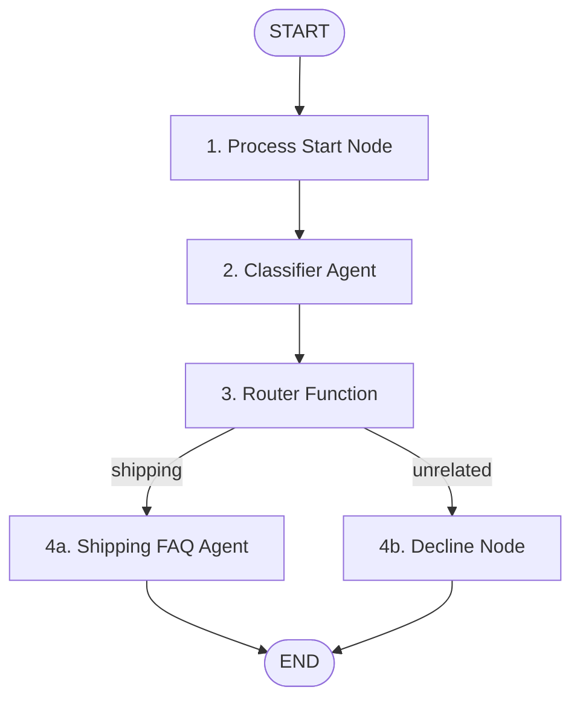

# shipping-agent

Agent generated with `agents-cli` version `0.5.0`

## 🤖 What This Agent Does
This project implements an automated **Customer Support Representative** agent for a shipping company using the **Google Agent Development Kit (ADK) 2.0**.

1. **Intelligent Query Classification**: When you ask a question, a specialized classification agent analyzes your query to check if it's related to shipping (such as tracking, rates, delivery times, or returns).
2. **Smart Routing**:
   - **Shipping Queries** are routed to a specialized Shipping FAQ agent. Responses concerning shipping rates are enthusiastic, filled with fun emojis, and highlight the **FREE shipping threshold on orders over $50.00**! 🚚🚀🎉
   - **Unrelated Queries** (e.g., general knowledge questions) are routed to a decline node that politely directs the user back to shipping-related topics.

## 🤝 Multi-Agent Architecture
This project is built as a **multi-agent system** using a directed workflow graph. Instead of a single LLM trying to do everything, tasks are split between specialized agents and programmatic logic:



- **`classifier` Agent**: A dedicated `LlmAgent` tasked solely with classifying user intents against a structured Pydantic schema.
- **`shipping_faq_agent` Agent**: A dedicated domain-specific `LlmAgent` trained on company policies to provide policy answers in a friendly, enthusiastic style.
- **Workflow Orchestration**: Structural Python nodes (`process_start`, `router_node`, and `decline_node`) control the routing and execution flow based on output states.

## Project Structure

```
customer-support-agent/
├── app/         # Core agent code
│   ├── agent.py               # Main agent logic
│   └── app_utils/             # App utilities and helpers
├── tests/                     # Unit, integration, and load tests
├── GEMINI.md                  # AI-assisted development guide
└── pyproject.toml             # Project dependencies
```

> 💡 **Tip:** Use [Gemini CLI](https://github.com/google-gemini/gemini-cli) for AI-assisted development - project context is pre-configured in `GEMINI.md`.

## Requirements

Before you begin, ensure you have:
- **uv**: Python package manager (used for all dependency management in this project) - [Install](https://docs.astral.sh/uv/getting-started/installation/) ([add packages](https://docs.astral.sh/uv/concepts/dependencies/) with `uv add <package>`)
- **agents-cli**: Agents CLI - Install with `uv tool install google-agents-cli`
- **Google Cloud SDK**: For GCP services - [Install](https://cloud.google.com/sdk/docs/install)


## Quick Start

Install `agents-cli` and its skills if not already installed:

```bash
uvx google-agents-cli setup
```

Install required packages:

```bash
agents-cli install
```

Test the agent with a local web server:

```bash
agents-cli playground
```

You can also use features from the [ADK](https://adk.dev/) CLI with `uv run adk`.

## Commands

| Command              | Description                                                                                 |
| -------------------- | ------------------------------------------------------------------------------------------- |
| `agents-cli install` | Install dependencies using uv                                                         |
| `agents-cli playground` | Launch local development environment                                                  |
| `agents-cli lint`    | Run code quality checks                                                               |
| `agents-cli eval`    | Evaluate agent behavior (generate, grade, analyze, and more — see `agents-cli eval --help`) |
| `uv run pytest tests/unit tests/integration` | Run unit and integration tests                                                        |

## 🛠️ Project Management

| Command | What It Does |
|---------|--------------|
| `agents-cli scaffold enhance` | Add CI/CD pipelines and Terraform infrastructure |
| `agents-cli infra cicd` | One-command setup of entire CI/CD pipeline + infrastructure |
| `agents-cli scaffold upgrade` | Auto-upgrade to latest version while preserving customizations |

---

## Development

Edit your agent logic in `app/agent.py` and test with `agents-cli playground` - it auto-reloads on save.

## Deployment

```bash
gcloud config set project <your-project-id>
agents-cli deploy
```

To add CI/CD and Terraform, run `agents-cli scaffold enhance`.
To set up your production infrastructure, run `agents-cli infra cicd`.

## Observability

Built-in telemetry exports to Cloud Trace, BigQuery, and Cloud Logging.
